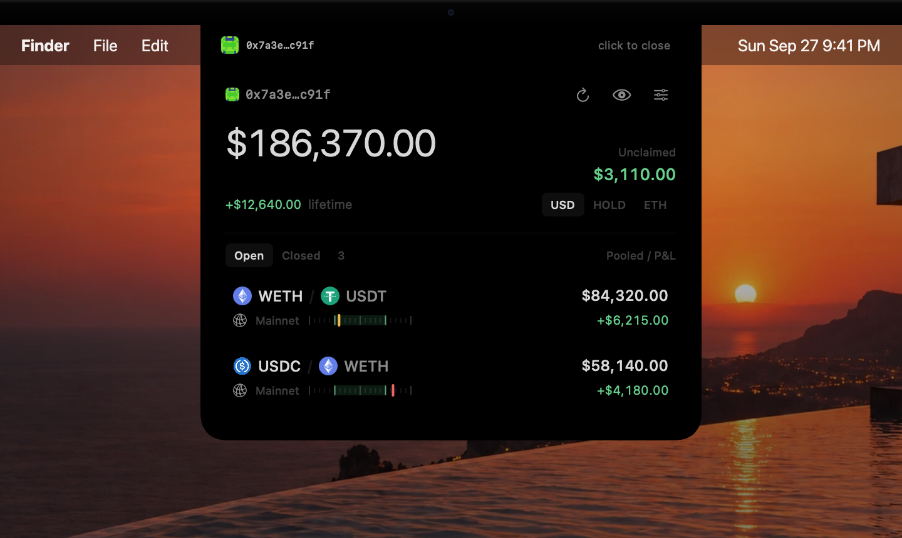

# Poolside

A native macOS notch prototype for read-only Revert position analytics. SwiftUI interface, AppKit panel, no third-party dependencies. Requires macOS 14+. The included app build targets Apple silicon.



Expand, open a position, switch benchmarks, close — [watch the demo](docs/poolside-demo.mp4). Scripted and recorded by `Tools/Recording/`.

## Download

Grab the latest build from [Releases](https://github.com/0xaaiden/poolside/releases) — Apple silicon, macOS 14+, ad-hoc signed. On first launch: right-click the app → **Open** (or `xattr -d com.apple.quarantine Poolside.app`) since it isn't notarized.

## Repository layout

- `Sources/Poolside/` — native macOS app.
- `Validation/` — native validation checks.
- `docs/` — API and product analysis, demo media.
- `Tools/` and `license.sh` — developer-side Pro key issuing tool (never shipped in the app); `Tools/Recording/` — scripted ScreenCaptureKit demo capture (`bash Tools/Recording/record-demo.sh out.mp4`).

## Run

Build with `bash build.sh`, then open **Poolside.app** in the parent folder. The app sits at the top of the display; its menu-bar icon provides Show, Wallet & appearance, and Quit.

1. Continue through onboarding, enter a public 0x wallet address, and select System, Light, or Dark.
2. Alternatively, choose **Explore the saved example** for an explicitly labeled offline snapshot of the supplied wallet.
3. Click a position for its range, balances, P&L, ROI, fee APR, and pool ID.
4. Hover the strip to expand; click the strip or press Escape to collapse. Hovering and clicking the strip never take keyboard focus away from the app you are working in, so the header reads “click to close” until you click inside the panel body, after which it reads “esc to close.” After the first run the app launches as a collapsed strip.

The wallet address is sent only to api.revert.finance when using live mode. Token icons are the one other network use: the contract addresses of tokens in positions currently on screen go to Revert's icon proxy (`/v1/proxy/codex-icons`), and the image files it names are downloaded from token-media.defined.fi and cached under ~/Library/Caches. Address and appearance preferences persist locally in UserDefaults. No keys, wallet signing, transactions, or analytics are involved. Bundled identity icons include source attribution.

## Build and validate

```sh
bash build.sh
bash validate.sh
```

Open Package.swift in Xcode for development. `swift build` is also supported on a healthy Swift 6 toolchain. On the development machine, swift-package failed to launch because of a missing BuildServerProtocol symbol; build.sh uses swiftc directly and packages an ad-hoc-signed app. This is a local development build, not a notarized distribution.

Command Line Tools can select an SDK newer than the compiler supports. Both scripts source `sdk.sh`, which probes the installed SDKs from newest to oldest and caches the first one that compiles under `.build/sdk-path`. The first probe takes about a minute; later runs are instant. Set `POOLSIDE_SDK` to a specific SDK path to skip probing.

`validate.sh` compiles the model layer with `Validation/Check.swift` and exercises decoding, totals, partial sums, token lookup, price ranges, the spring and panel-motion math, the hover gate and the wallet identicon.

## Implemented

- Camera-aware top panel, menu-bar fallback controls, automatic display geometry updates.
- Three-step onboarding; System/Light/Dark preference; saved wallet; labeled offline example.
- Active positions endpoint with v4 and Ekubo flags, cursor pagination, duplicate suppression, pagination loop guard.
- Decimal arithmetic, string/number decoding, optional metrics rendered as unavailable.
- Pooled assets separate from unclaimed fees; lifetime USD and vs-HOLD P&L. Totals are computed once per update; when a position lacks a value the total shows the available sum prefixed with ≈ and explains itself on hover instead of blanking.
- Position detail, range indicator, source timestamp, stale marker, retry button, preserved in-memory data on failed refresh.
- Impermanent loss per selected benchmark and lifetime gas spent, from Revert's performance and cash-flow data.
- Positions earning within 8% of an LP bound warn with an amber marker and "near lower/upper bound" instead of plain green.
- Privacy mask: the eye button in the dashboard header renders every amount as •••; persisted between launches.
- Custom wallet labels, edited inline in the wallet step and shown in the header strip, wallet menu and alerts.
- 60-second polling; 180-second delay following errors; explicit empty and loading states.

## Prototype boundaries

API decoding is verified against the two supplied Uniswap v4 positions and a live Uniswap v3 full-range position on Unichain. Revert varies field types by protocol (v3 sends `fee_tier` as a string), so whole numbers and booleans decode from either numbers or strings, rows are decoded individually and any unreadable row is skipped and reported in a notice instead of failing the wallet, and decoding failures name the offending field. Full-range positions render as a band across the whole bar with ∞ as the upper bound. One automatically selected screen. No chart history, persistent response cache, custom shortcuts, fiat conversion or transaction actions yet. Hover expands and remains open until collapsed intentionally. Panel size, content reveal, navigation, onboarding steps and benchmark selection all share one spring (0.34 s response, 0.86 damping) so nothing finishes before anything else; closing uses a quicker critically damped spring (0.24 s response) so the strip settles without a bounce; number updates, range markers and hover feedback have restrained transitions. Motion is disabled when macOS Reduce Motion is enabled. Large text/accessibility and physical-notch/full-screen behavior need testing across real hardware configurations.

The [API/product analysis](docs/API-and-product-analysis.md) separates observed fields, inferred semantics, and production work still required.

## Free and Pro

Free is the complete read-only tracker. Pro adds convenience and depth. Entitlements live in one place, `Entitlements` in `Sources/Poolside/License.swift`, and every gate in the UI reads `store.entitlements`.

| | Free | Pro |
|---|---|---|
| P&L benchmarks | USD, HOLD | USD, HOLD, ETH, and each position’s own tokens in the detail view |
| Automatic refresh | every 60 s | every 15 s |
| Launch at login | — | yes (SMAppService, no helper) |
| Range alerts | — | notification when a position leaves or re-enters its range between refreshes |
| Wallets | 1 | up to 5, switched from the dashboard title |
| Closed positions | — | exited positions with realized P&L, deposits, withdrawals, collected fees and dates |

Keys are verified offline. A key is `POOLSIDE-<payload>-<signature>`: base64url compact JSON `{t, id, exp?, iat}` and an Ed25519 signature over it, checked against the public key embedded in the app. No server, account or network is involved; the app never holds the private key. Saved keys are re-verified on every launch, so an expired or tampered key silently drops to Free. Enter or remove a key in the appearance step of onboarding (menu bar → Wallet & appearance, or click any locked chip).

Issuing keys, on the developer machine only:

```sh
bash license.sh keys                         # once: writes .license/private.key (gitignored), prints the public key to embed
bash license.sh issue ada@example.com        # perpetual Pro key
bash license.sh issue trial-42 2026-12-31    # expiring Pro key (UTC date)
bash license.sh verify POOLSIDE-…            # check any key against the embedded public key
```

Rotating the signing key invalidates every issued key. Back up `.license/private.key`.

## Wallets and closed positions

Tracked wallets live in a `WalletBook` persisted under the `wallets` default, with the legacy single `wallet` default kept as the active pointer so older installs migrate on first launch. Addresses are compared case-insensitively and keep the typed casing. The wallet step of onboarding lists wallets with select and remove controls and an add field; the dashboard title becomes a menu when more than one wallet is tracked. Each wallet's last data is cached in memory, so switching is instant and refreshes in the background. Free tracks one wallet; adding another shows a Pro hint.

Closed positions come from the same endpoint with `active=false`; Revert fills `deposits_value`, `withdrawals_value`, `fees_value` (lifetime collected fees) and `ts` (closing time) for exited rows. The Open / Closed switch above the list swaps the summary to realized P&L, fees collected and total withdrawn, rows show the closing date and withdrawn value, and the detail view shows deposited, withdrawn, collected fees, open and close dates and withdrawn token amounts instead of a range chart. Closed data loads on first view and refreshes with the manual control or when older than five minutes; open positions keep polling. The example wallet includes a bundled `sample-closed.json` with two Aerodrome positions on Base.

## Compact redesign

The expanded overview is 400 × 332 points on a 32-point menu bar (width adapts to the camera gap). Details expand vertically to 442 points. Borderless rows, a monochrome surface, muted gain/loss accents and a tick-based range graphic with wider price context replace the original large cards. Both camera-side controls are independent accessible buttons. Pointer tracking is event-driven: a global mouse-moved monitor (no permission required for mouse events) and a local monitor feed a gate that arms a 180 ms dwell timer on entry and cancels it on exit. Nothing runs while the cursor is still. The gate region is the visible collapsed strip plus a few points below it. After a dismissal the gate stays closed until the pointer physically leaves, so resize-generated hover events cannot reopen it.

## Range context and icons

The chart adds half the LP range width on each side and extends further when needed to include the current price. LP bounds form a highlighted band; the current-price marker is never clamped to that band. The detailed view labels the outer axis and LP bounds separately. The domain never extends below zero. Unknown or invalid ranges show no invented band.

Token badges appear next to both assets; chain icons sit next to the network. USDG uses a bundled icon matched by network and contract address. Every other token asks Revert's Codex icon proxy, keyed by network id and contract address, never by symbol. `TokenIcons` (Sources/Poolside/Icons.swift) folds the requests from rows that appear within 40 ms into one POST, downloads at most six images at a time, caches them in memory and on disk, and shows a two-letter monogram while loading, when the proxy has no icon (the native ETH placeholder address, for example) or when the network name is not in its chain-id table. A failed request is forgotten so a later scroll retries; a token the proxy does not know is not asked again that session. Robinhood uses its provided avatar. See Resources/Icons/ATTRIBUTION.md.

## Large wallets

The position list is a `LazyVStack`, so a wallet with hundreds of open positions builds only the rows on screen. Each row carries a hover tracking area and tooltips that AppKit re-registers on every frame of the panel spring, so the number of live rows sets the cost of opening the panel. The range graphic is a single `Canvas` draw plus an animatable marker shape instead of about forty views per row. `bash bench.sh <wallet.json>` lays the real dashboard out offscreen and reports timings; for a 303-position wallet the first layout after data went from about 960 ms to under 20 ms and a spring frame from 22 ms to under 1 ms on the development machine.

The dark surface is pure black to join the camera strip. The native window shadow is disabled. Escape handling is local to the panel and requires no global keyboard or Accessibility permission, so it works once the panel has keyboard focus. Focus is taken deliberately and never during a transition: hovering and clicking the header strip leave focus alone, while clicking inside the panel body, the menu-bar Show command, onboarding, or a text field make the panel key. Collapsing never re-orders or hides the window, so the closing motion is a single uninterrupted spring.

## Wallet identity and financial colors

The header uses a local native port of blo’s Ethereum blockies algorithm and a shortened wallet address. See THIRD_PARTY_NOTICES.md for upstream attribution and license. No ENS name is inferred. Unclaimed fees are green; P&L and pool P&L use green for positive, red for negative, and neutral for zero or unavailable values. The fee label remains unclaimed because the displayed value is pending fees, not fees already collected.

## Top-edge expansion

A single native resize driver preserves the screen’s top edge on every frame; the panel opens downward. SwiftUI does not independently animate the expansion layout, and the content ignores automatic safe-area insets. Frames are produced by a `CADisplayLink` obtained from the screen, so motion runs at the display’s native refresh rate (120 Hz on ProMotion) without timer jitter. Width, height and reveal progress are analytic damped springs; an interrupted transition starts a new spring segment from the current position and velocity, so reversals never jump. Reduce Motion still applies.

The bottom footer has been removed. Manual refresh and last-update information are available in the header control; stale data changes its icon. Fetch failures remain visible inline.

## Roll-down refinement

The panel’s contents stay mounted through opening and closing. A single reveal progress value coordinates native resizing, a subtle 24-point downward slide from behind the camera strip, opacity and bottom corner rounding. The hosting geometry explicitly aligns the full content at the top, preventing implicit vertical centering during resize. Reduce Motion skips the reveal.

The store uses the Observation framework rather than `ObservableObject`, so the per-frame reveal updates only re-evaluate the container view that reads them; the dashboard, rows and range bars are left alone during the animation. Number formatters are cached per precision, portfolio totals are computed once per positions update, token lookups hit the dictionary directly, and wallet identicon pixels are cached per address.
