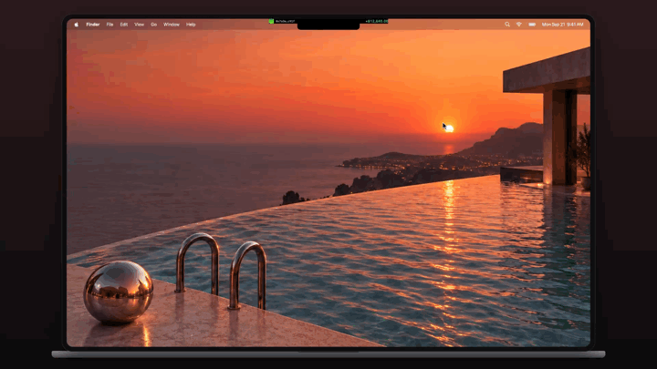

# Poolside

**Your LP positions, living in your Mac's notch.**

Poolside is a small, native macOS app that keeps an eye on your liquidity positions for you. Glance up to see your P&L, hover the notch to see everything else, and get back to what you were doing.

[](docs/poolside-demo.mp4)

## Features

- **Lives in the notch.** A slim strip shows your wallet and P&L. Hover to roll it open, click or press `Esc` to tuck it away. It never steals focus from the app you're typing in.
- **All your numbers at a glance.** Pooled assets, unclaimed fees and lifetime P&L across every open position.
- **A closer look at any position.** Price range with a live marker, balances, ROI, fee APR, impermanent loss and gas spent.
- **A heads-up before you drift.** Positions turn amber when the price gets close to the edge of their range.
- **P&L your way.** Compare against USD, holding, ETH, or either token in the pair.
- **Closed positions too.** Realized P&L, fees collected and what you withdrew.
- **More than one wallet.** Add a few, give them names, and switch in a click.
- **Privacy mask.** One tap on the eye hides every amount, handy when you're sharing your screen.
- **Not just Uniswap.** Works with any LP position Revert tracks, like Uniswap and Aerodrome.
- **Read-only and private.** Just paste a public address. No wallet connection, no signing, no keys, no tracking.

## Install

You'll need a Mac with Apple silicon running macOS 14 or later.

### Download

1. Grab `Poolside-macOS.zip` from the [latest release](https://github.com/0xaaiden/poolside/releases).
2. Unzip it and drag **Poolside** into your Applications folder.
3. The first time, right-click Poolside and choose **Open**. The app isn't notarized by Apple yet, so macOS asks you to confirm once. If it still won't open, run:

   ```sh
   xattr -d com.apple.quarantine /Applications/Poolside.app
   ```

4. Look up at your notch, hover it, and paste in a wallet address.

### Build it yourself

If you have the Xcode Command Line Tools (`xcode-select --install`), it's two commands:

```sh
git clone https://github.com/0xaaiden/poolside.git
cd poolside && bash build.sh
```

That builds `Poolside.app` next to the project folder. Open it and you're set. You can also open `Package.swift` in Xcode.

## License

Poolside is open source under the [MIT License](LICENSE). Use it, fork it, make it yours.
